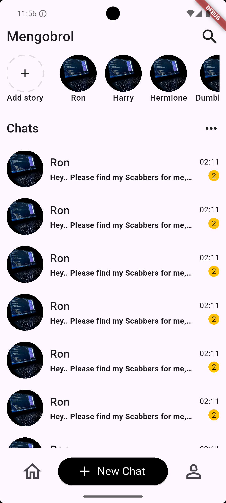

# Mengobrol Chat App UI (Static)

A Chat app UI inspired by [Mengobrol - Chat App by Asal Design](https://dribbble.com/shots/22351367-Mengobrol-Chat-App), created using Flutter.

**Note** - It is just a Static UI, I tried to clone it for practicing flutter basics, Widgets like Column, Row, SingleChildScrollableView, SafeArea etc.

## Table of Contents

- [Installation](#installation)
- [Screenshot](#screenshot)

## Installation

### Prerequisites

Ensure you have the following installed:

1. Flutter SDK: Install the latest stable version from the Flutter website.
2. IDE: Android Studio or VS Code (recommended for Flutter development).
3. Git: Necessary for cloning the repository.

Ensure environment is ready

```bash
flutter doctor
```

### Installation step

1. Clone the repository

```bash
 git clone https://github.com/indexdothtml/Mengobrol-Chat-App-UI
```

2. Install dependancies

```bash
flutter pub get
```

3. Run project

```bash
flutter run
```

## Screenshot


